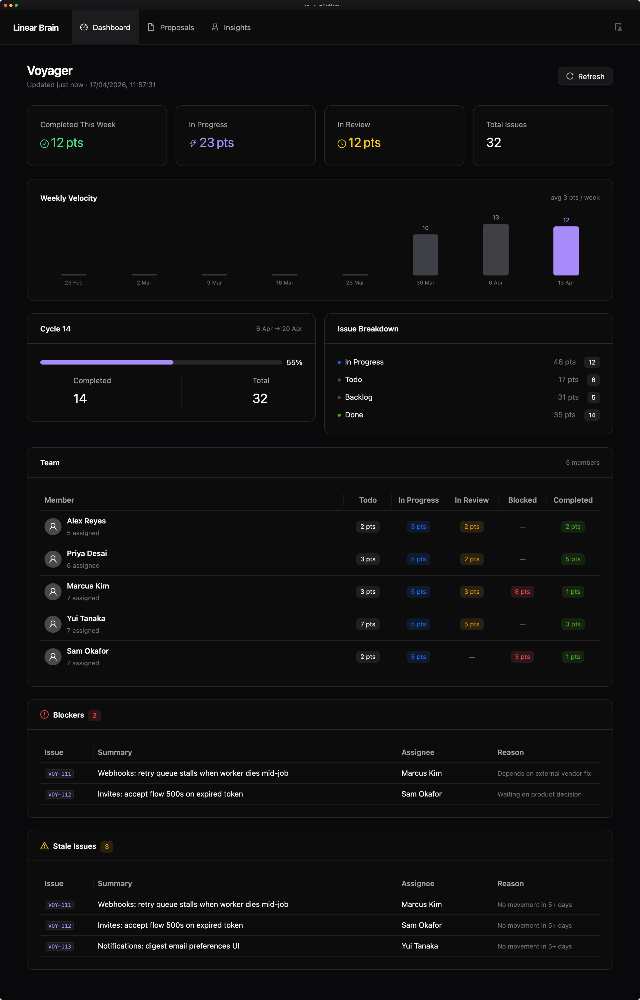
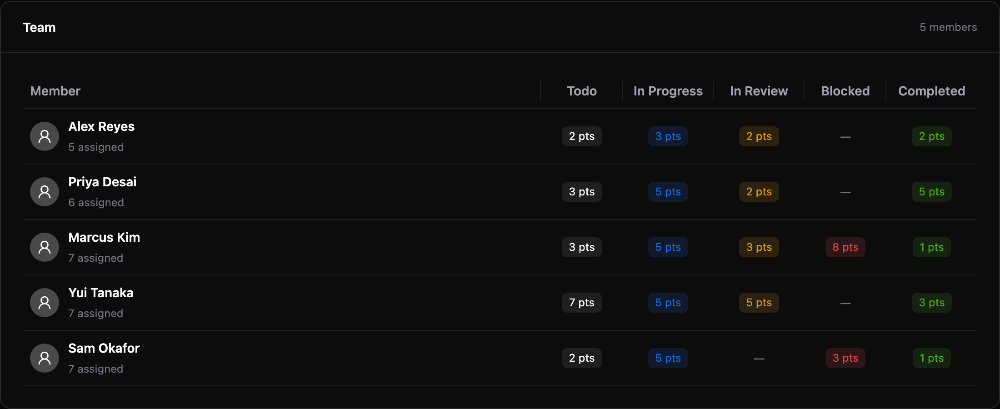
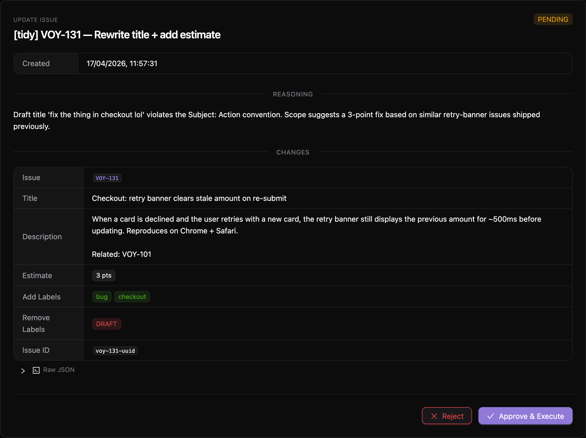
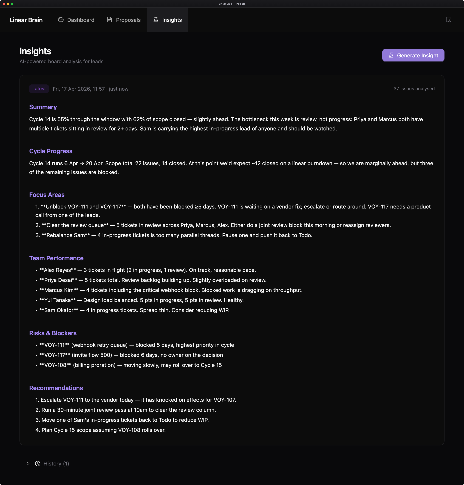
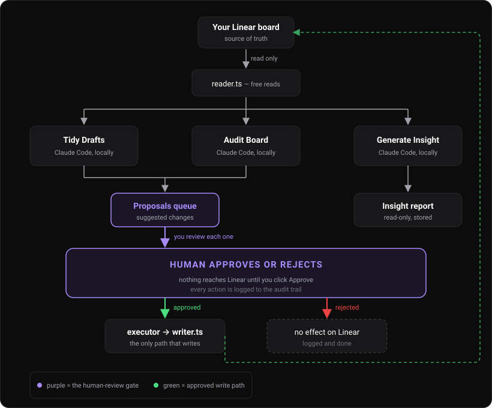

# Linear Brain

**An AI project manager for your [Linear](https://linear.app) board. You stay in charge — the AI just does the grunt work.**

If you're on a small team without a dedicated PM, Linear Brain quietly does the tidying, chasing, and reporting a PM would do. It reads your board, suggests fixes, writes you a daily briefing, and never changes a single ticket until you approve it.

<p align="center">
  
</p>

---

## What it actually does for you

**Tidies messy tickets.** Click one button and the AI rewrites rough `DRAFT` tickets into your team's format — proper titles, labels, estimates, descriptions. Each cleanup arrives as a proposal for you to approve.

<p align="center">
  
</p>

**Audits the whole board.** Finds tickets with missing estimates, sloppy labels, related duplicates, and bugs hiding in the comments. Again — proposals only, not live changes.

**Writes you a morning briefing.** Every morning, Claude reads the whole board and produces a PM-style report: what's on track, who's overloaded, what's blocking the week, and what you should do about it.

**Never touches Linear without your OK.** Every write operation is queued as a proposal. You approve or reject. Nothing the AI suggests hits your board until you click a button.

---

## New to AI tools? Here's the honest pitch

A lot of AI products promise magic. This one doesn't. Linear Brain is a pretty simple idea:

1. **Read your board** (safe — nothing changes).
2. **Ask Claude what's wrong with it** (safe — still nothing changes).
3. **Queue the suggestions** for you to review.
4. **You say yes or no.** Only then does anything change in Linear.

You never hand over control. You can walk away, delete the approval queue, and your board will be untouched. The AI is a suggestion engine with a human-shaped lock on the door.

---

## Your day with Linear Brain

Linear Brain is built around a simple daily rhythm. You don't need to follow it to the letter — but this is what the tool is shaped for.

### Morning — 5 minutes

**Open the dashboard.** A quick read on who's got what, what's blocked, what's drifting.

<p align="center">
  
</p>

**Hit "Audit Board".** The AI scans every active ticket and writes proposals for anything it thinks is off — missing estimates, inconsistent labels, related tickets worth linking. Each one shows up in your queue with a reason.

<p align="center">
  
</p>

Approve the good ones, reject the rest. Or **Approve All** if you trust the run.

**Hit "Tidy Drafts"** if the team left rough tickets overnight. The AI cleans them up and sends them back as proposals.

### Before standup — 1 minute

**Hit "Generate Insight".** Claude Opus reads the whole board and writes a proper briefing.

<p align="center">
  
</p>

The report is blunt on purpose — it names who's overloaded, what's stuck, and what the leads should do about it today.

### Weekly — 2 minutes

Scroll back through the insight history. Patterns show up clearly when you compare briefings side by side — who's chronically blocked, which work bloats cycle after cycle, where the team's time actually goes.

---

## You're always in charge

This is the part people usually ask about first when AI is involved, so:

- **Reads are free, writes are gated.** Linear Brain can read from Linear as often as it likes. It can *never* write without a proposal that you explicitly approved.
- **One module can write.** Only `writer.ts` imports Linear's mutation methods. Only `executor.ts` imports `writer.ts`. The executor refuses to run anything whose status isn't `approved`.
- **Everything is audited.** Every approval, rejection, and execution is written to a log you can read at `/audit`.
- **It's your Claude.** Headless actions shell out to the [Claude Code](https://claude.com/claude-code) CLI on your machine. No Anthropic API key sits in the app. Your board data goes to Claude the same way it would if you were chatting with it yourself.

You can delete the whole `data/brain.db` file and your Linear board is untouched. The queue is not the source of truth — Linear is.

---

## Setup

### What you need

- [Bun](https://bun.sh) (latest stable)
- The [Claude Code](https://claude.com/claude-code) CLI installed and on your `PATH`
- A Linear API key (Linear → Settings → API → Personal API keys)

### Install

```bash
bun install
cp .env.example .env          # add your LINEAR_API_KEY
cp BOARD_RULES.example.md BOARD_RULES.md
# edit BOARD_RULES.md to describe your team's naming/label conventions
```

### Run

```bash
# Development — Vite with HMR + API auto-reload
bun run dev

# Production — builds the frontend, then starts the server
bun run start
```

Dev mode: frontend at `http://localhost:5173`, API at `http://localhost:3000`. Production: everything on `http://localhost:3000`.

### Test

```bash
bun test
```

---

## How it works under the hood

<p align="center">
  
</p>

The three AI actions — Tidy Drafts, Audit Board, Generate Insight — all run by shelling out to `claude -p` locally. The server gathers the board state, hands it to Claude with a structured prompt, and parses the response into proposals (or, for insights, a stored report).

The write path is deliberately narrow: only `executor.ts` imports `writer.ts`, and the executor refuses to run any proposal whose status isn't `approved`. That's the whole safety story.

## Philosophy

A few ideas shape how Linear Brain is built. None of them are precious — if any don't fit your team, fork it and change them.

- **Collect, overview, safely write.** That's the whole job. Pull signal from Linear, show it clearly, propose changes, let a human decide.
- **The dashboard does not use AI.** It's a straight Linear API aggregator with some SQLite caching. The AI only shows up on the Proposals and Insights pages, where it's explicitly labelled. If you don't trust AI, you can still use the dashboard as a standalone read-only view of your board.
- **Local by default.** The AI is Claude Code running on your laptop, shelled out to as if it were a private API. Your board data doesn't pass through a hosted service. This also means you don't need an Anthropic API key — the tool uses your existing Claude Code subscription.
- **Opinionated out of the box, but only barely.** Defaults assume your team roughly follows *some* consistent labelling and naming convention. You'll want to edit `BOARD_RULES.md` to match yours — the AI reads that file on every run.
- **Designed to be forked, not plugged into.** The codebase is deliberately small and readable. Team-specific behaviour should live in your fork, not behind a plugin API.

## Making it yours

Most teams will want something different from the defaults. That's the expected path:

- **Light customisation** — labels, naming conventions, draft workflow, tone of voice for insights — lives in `BOARD_RULES.md`. Edit the file; the AI picks it up on the next run. No code changes.
- **Heavier customisation** — new actions, different proposal types, a different UI — is a fork. Clone the repo, open it in Claude Code, describe the change you want. The file layout is documented in `CLAUDE.md` so Claude knows where to reach. We've found "ask Claude to modify the thing" works better than trying to design a flexible abstraction up front.
- **Running it for a whole team.** Linear Brain runs locally by default because headless AI actions shell out to the Claude Code CLI. If you want one shared deployment that everyone points at, swap those CLI calls (in `src/actions/*.ts`) for the Anthropic API, add an `ANTHROPIC_API_KEY` to `.env`, and put the dashboard behind auth. The wiring isn't built in — but it's maybe an afternoon's work, and the approval queue logic stays unchanged.

If you find a fix or a genuinely general improvement that isn't team-specific, a PR to this repo is welcome. Team-specific changes should stay in your fork.

## Tech stack

| Layer     | Tech                                                                       |
| --------- | -------------------------------------------------------------------------- |
| Runtime   | [Bun](https://bun.sh)                                                      |
| Language  | TypeScript (strict)                                                        |
| Linear    | [`@linear/sdk`](https://github.com/linear/linear)                          |
| API       | [Hono](https://hono.dev)                                                   |
| Frontend  | React + [Ant Design](https://ant.design), built by [Vite](https://vite.dev) |
| Database  | SQLite via `bun:sqlite`                                                    |
| AI        | [Claude Code](https://claude.com/claude-code) CLI (Opus for actions, locally) |

## API reference

| Method | Endpoint                             | Description                               |
| ------ | ------------------------------------ | ----------------------------------------- |
| `GET`  | `/api/proposals`                     | List proposals (filter by `?status=`)     |
| `GET`  | `/api/proposals/:id`                 | Get a single proposal                     |
| `POST` | `/api/proposals`                     | Create a proposal                         |
| `POST` | `/api/proposals/approve-all`         | Approve + execute all pending             |
| `POST` | `/api/proposals/reject-all`          | Reject all pending                        |
| `POST` | `/api/proposals/:id/approve`         | Approve + execute a proposal              |
| `POST` | `/api/proposals/:id/reject`          | Reject a proposal                         |
| `GET`  | `/api/dashboard`                     | Latest dashboard snapshot                 |
| `POST` | `/api/dashboard/snapshot`            | Refresh dashboard data from Linear        |
| `GET`  | `/api/insights`                      | List all insights                         |
| `POST` | `/api/insights/generate`             | Generate a new AI insight                 |
| `POST` | `/api/actions/clean-drafts`          | Tidy all DRAFT tickets                    |
| `POST` | `/api/actions/audit-board`           | Audit the board for issues                |
| `GET`  | `/api/audit`                         | Audit log entries                         |
| `POST` | `/webhooks/linear`                   | Linear webhook receiver                   |

## Licence

MIT
